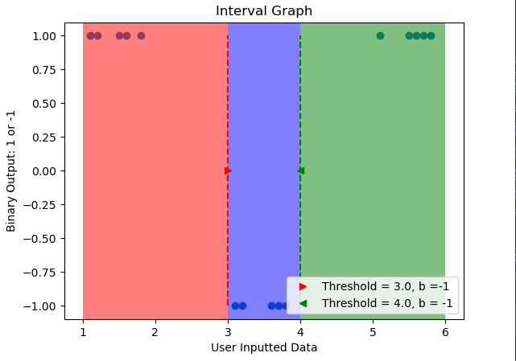

### Machine Learning Portfolio
This portfolio is supposed show our progress in Machine Learning, so I hope that I was able to accomplish that objective. 

The index below will allow the reader to jump to that exact section of the document making it easier to read. Everything here will have the same documentation as if you were to go through each folder seperatly. 

**Index** 
1. [Perceptron Learner](#id1)
2. [Low VC Dimensional Learners](#id2)
3. [Interval Learner](#id3)
4. [Threshold Learner](#id4)
5. [Linear Regression](#id5)
6. [Logistic Regression](#id6)
7. [Soft SVM](#id7)
8. [k Nearest Neighbor](#id8)

### Perceptron Class 

## Introduction
The Perceptron Class is a supervised learner, as in it uses a set of biases (weights) to work itself
into the right answer, or within a certain amount error. The Perceptron Class works by taking a data and
that has been split into a 0 or 1, or binary set, as well as a training set of data. It uses a linear function and
its weights to slowly learn how to predict an output.

## Theory Time 
The Perceptron Class is a linear, binary classifier which uses matrix math (in this case) to figure out a linear line for a given dataset. 
The output of the Perceptron is either a 1 if w * x + b > 0 or it is a 0. 

w is the wieght vector of and acts as the slope of the line. 
b is the intercept of the line (stored within the weights matrix) 

The weights are adjusted using by using the current weight plus the learning rate times the rate of change between the current predicted output value and the actual output value plus the input values.

## Class Outline 
 The class has five functions: 
 - i.   __init__()
 - ii.  fit()
 - iii. net_input()
 - iv.  predict()
 -  v.   plot()

# __init(rate=float, niter=integer)__
This function creates an instance of the class.
The variable rate is used as a refining variable as it will change the step size as the fit() function tries to find the line of best fit.
The variable niter is used as how many maximum iterations the fitting function will use.
Adjust either the learning rate variable and or the number of iterations if the line does not fit the data.
Use: Percpetron(rate = float, niter=float) and assign to an object.

# fit(X=[2 by n] ndarray, y=[1 by n] ndarray)
This function takes in
a training vector that is composed of samples and features. The samples is just raw training data that it will
use to work on improving itself. The features is how many different types of training is within the data set.
Lastly, this function takes in a list of target values, these are the correct responses to the data set that the
Perceptron Class should achieve.
The Perceptron Class uses an array, specially a ndarray from the Numpy library, whose size is that of the
amount of features plus one, which is due to how the algorithm works. The first index is the Basis of the
entire Perceptron, the other two weights are meant to help the Perceptron bring balance to the world. One
could hypothetically create multiple instances of the Perceptron Class and then feed their outputs into the
inputs of another layer of Perceptron’s, but such an idea would never work… Anyway, some people prefer
to use a completely random bias value, but we did not do that for our class. We decided to loop through the
training data collecting any mistakes it made into a list that holds the amount of errors the Perceptron Class 
makes on its way to learning the training data. As the Perceptron is biased by the learning rate times the
delta between the target data and it’s attempt at predicting the rate, this value will be stored in the bias
index of the weight array, but this value will also be used for the weights themselves.
The Perceptron Class will form its weights, or inputs, by taking the bias and multiplying it by the current
raw data itself and add itself its previous value. If the bias is not equal to zero, then we start a counter and
add one to itself. After going through all of the data we will then add the error to the error list. Basically
this is how computer scientists treat machines as children, this method is the same as watching a kid fall
down a bunch times while trying to ride a bike until they figure it out. Of course, we do not want a kid to
keep proving a million times that they know how to ride a bike on their own, so we also need to check and
see if the Perceptron has mastered the data set. To solve this problem we decided that the Perceptron Class
has mastered the data set if it has two runs with a bias change of zero. If this is the case then we return the
fully trained Perceptron Class.

#predict(X[2 by n] ndarray])
The predict fucntion works by calling the net_input() function
given the training data, then determines if that result is greater than equal to zero. It then returns one if it is
true or it selects the negative one if the expression is false. The net_input() function utilizes the magic of
the Numpy library and the power of a dot product. This function simply takes in part of the data set, then
preforms the dot product between the data and its weights. It then adds this result with bias.

# plot(X[2 by n] ndarray, y[1 by n] ndarray)
This function calls the plot_decision_regions() fucntion which creates a graph of the data. 
The arrays must be the specified ndarrays and cannot exceed 5 features, unless you care to edit the plot_decision_regions() function.

## Usage
Just run the included test file or do the following: 
To run the Perceptron Class, the user must download the ML.py file into a folder that they are planning on
using the Perceptron Class. The user must then provide a training vector X, whose shape takes the form of [
number of samples, number of features], a target vector Y, whose values must either be -1 or 1, and be the
same length as the number of samples within the X vector. For our first example we will use the Iris data
set, given the following URL link 'https://archive.ics.uci.edu/ml/machine-learning-databases/iris/iris.data'.

We will import the following libraries pandas, numpy, and matplotlib.

Next we will gather the data using the pandas library function read_csv(), which allows the data set to be
read from a csv file. We then create a list from the 4th column of the Irsi data set, by using y =
df.iloc[0:150, 4].values. We then need to change the values of the desired output, which in this case is the
y list values that match the Iris-setosa label and assign it -1 otherwise it becomes a 1, by using y =
np.wher(y == ‘Iris-setosa’, -1, 1). Lastly, we need the raw data input, which we will grab from the zero
column and the second column of the data set by using X = df.iloc[0:150, [0,2]].values.

Now we will need to import from the ML.py file in which the Perceptron Class exists by using from ML
import Perceptron. We will then create an object to become the almighty binary overlord that the
Perceptron Class is by using pn = Perceptron(0.1, 10). As stated before the values of the Perceptron are as
the learning rate and number of iterations that the Perceptron will use to learn the dataset. Lastly, we will
use the object and train it on the data sets by using pn.fit(X, y).

Lastly, just call the plot fucntion with the same dataset or a dataset that fits the previous requirements for the class.

Please see the included PDF for more documentation. 

## Output
Here is an output from my PDF. 

### Low VC Dimensional Learners 
Low VC Dimensional Learners are extremely simple learners, such as the two that were choosen for this project. I used the Interval Learner as well as the Threshold Learner. There is a slight difference between these two types but they both use a threshold value to determine what label the input data should be assigned for an output. 

These learners can be shattered by a data set of n+1, which is to say that a dimension above would stop it from working correctly. You can of course create more than Threshold or Interval Learner to be used for each dimension. 

Both of these Learners should be feed a data set of 1-dimension of n elements.

### Interval 

## Introduction
The Interval leaner is another 1-d leaner and acts as if there are two threshold learners that are being used. This leaner uses two different thresholds to create a range (interval) that contains only the input values that yield the correct output values. 

## Theory 

## Class Outline
The class has the following functions: 
The class is composed of the following functions:
- i.   __init__()
- ii.  predict() 
- iii. graph()

# __init__(minthreshold=float, maxthreshold=float, iteration=integer, b=integer[must only be 1 or -1])
The __init__() function initializes the class and assigns it to an object. The user must pass in the following values for class variables: 

minthreshold – float variable that holds the minimum threshold value, default is 0.5, but if the user does not know the minimum value in there set then it is recommend that they enter minimum value of their x-array values. 

maxthreshold – float variable that holds the maximum value that the threshold could be, default is 1.0, but if the user does not know the maximum value then it is recommended that they enter the maximum value of their x-array values. 

iteration – integer variable that holds the maximum amount of iterations the threshold learner will take to figure out the data set. Note: Increase this value for a more refined search of the most efficient   
b – integer (should be treated as a Boolean) used by the user to focus on either the desired y-output of 1, or -1, default is 1. Note: User can enter a different value then -1, as the program will still treat that other value as -1. 

Next, we need to talk about the threshold values, which threshold1 is defaulted to the minimum threshold value and threshold2 is defualted to the maxinimum value, once the user uses the class to predict a set of data. 

Lastly, we need to talk about the increment value, which takes the maximum threshold value and subtracts it from the minimum threshold value, this is then divided by the number of iterations that the user inputs. Note: This is why we informed the user to increase the number of iterations if they need a smaller step size between each iteration.   

## predict(x=\[n by 1] ndarray, y\[n by 1] ndarray) 
The predict() function takes in two 1-d numpy_array’s that hold the x-array and the y-array, which the y-array must be integers that are either 1, or -1. We decided to keep track of how many errors occur while trying to figure out the correct threshold value. We then determine if the user put in 1 or not 1 into the b-value, by checking to see if it is equal to 1. If it is equal to 1, the not_b is set to -1, otherwise not_b is set to 1. 

The function then loops from zero until the maximum value of iterations and preforms the following actions. We will compare the current x value to see if it less than the threshold value 1, if it is then we will do one last compare against the threshold value 2. If the value lies within this then it have a result of y\[i] = b. If it fails either of these, then the value must lie outside the range. 

We will use numpy to collect and compare the output values to the target set to see if you received any errors, if we did then we will adjust the threshold values. If no error is found then we have mastered the data set and can return the model. If the model still needs to be adjusted then we will increament the value of threshold 1 and decrrement the value of threshold 2.

Lastly, if the data is not mastered before we run out of iterations, we will have to return the value of the best predicted model. This is done the same way as the threshold learner. 

## graph(x=[n by 1] ndarray, y[n by 1] ndarray) 
This fucntion is used to graph the best fitted interval of the data set. Both x and y need to be 1 by n ndarrays. 

## Usage
Use the included test file or the following:
obj = IntervalLearner(float, float, integer, integer)
obj.fit(x, y)
obj.plot(x, y)

## Output
Here are images of the output from the included test file.

### Threshold Learner 

## Introduction
This creates a line (threshold value) on a dimensional and all values that lie left the line are assinged a target output value or all. Values that lie to the right of the line are then given negative value. This is a supervised learner as well as a binary learner. This means the target vector must be either 1 or -1. The learner will adjust the line to the right or left until learner runs out of iteratinons or has mastered it. 

## Theory 

## Class Outline 
The class is composed of the following functions:
- i.   __init__()
- ii.  predict() 
- iii. graph()

# __init__(minthreshold=float, maxthreshold=float, iteration=integer, b=integer[must only be 1 or -1])
The __init__() function initializes the class and assigns it to an object. The user must pass in the following values for class variables: 

minthreshold – float variable that holds the minimum threshold value, default is 0.5, but if the user does not know the minimum value in there set then it is recommend that they enter minimum value of their x-array values. 

maxthreshold – float variable that holds the maximum value that the threshold could be, default is 1.0, but if the user does not know the maximum value then it is recommended that they enter the maximum value of their x-array values. 

iteration – integer variable that holds the maximum amount of iterations the threshold learner will take to figure out the data set. Note: Increase this value for a more refined search of the most efficient   
b – integer (should be treated as a Boolean) used by the user to focus on either the desired y-output of 1, or -1, default is 1. Note: User can enter a different value then -1, as the program will still treat that other value as -1. 

Next, we need to talk about the threshold value, which is defaulted to the minimum threshold value once the user uses the class to predict a set of data. Lastly, we need to talk about the increment value, which takes the maximum threshold value and subtracts it from the minimum threshold value, this is then divided by the number of iterations that the user inputs. Note: This is why we informed the user to increase the number of iterations if they need a smaller step size between each iteration.   

# predict(x=[n by 1] ndarray, y[n by 1] ndarray) 
The predict() function takes in two 1-d numpy_array’s that hold the x-array and the y-array, which the y-array must be integers that are either 1, or -1. We decided to keep track of how many errors occur while trying to figure out the correct threshold value. We then determine if the user put in 1 or not 1 into the b-value, by checking to see if it is equal to 1. If it is equal to 1, the not_b is set to -1, otherwise not_b is set to 1. 

The function then loops from zero until the maximum value of iterations and preforms the following actions. We can leverage the numpy library by using the where() function, which will loop through the array and preform a regular expression on the entire array. As shown in the figure below, we look to see if the x-value is greater than the threshold value and if it is then we will assign a predicted y-value to the b-value, otherwise we assign the not_b value. 

We need to compensate for the ability of having a different b-value then just 1, so if not_b is equal to 1 then we need to set the 2-d compare array equal to the y-array in first row, followed by the middle-flipped predicted array, otherwise we do not flip the predicted array. The error usually would require another loop to be made, but numpy is a broken library, so we can make an entire function in a single line.

First, we will compare the difference between the two arrays, that have been stored within the 2-d compare array. We use “axis=0” as that will be between the rows within the library function. Now, we have an array of values that are either 1, 0, or -1, so we need to take the absolute value of the negative values by using absolute(). Now, we can use the same sum() function used for the Linear Regression Class. We have now looped through and added up all the errors that the threshold miscalculated. All in a single line instead of a function. 

Next, we add the newly calculated to the error array. We then check to see if we have zero error’s which means we have selected the correct threshold value and we can return the class. Otherwise, we will set the threshold value equal to the minimum threshold value plus the increment value times the current iteration.

Lastly, if we need to make sure that we use the threshold value with the least amount of miscalculations. This is done by finding the indices of where the minimum error occurred as they are directly correlated to the iteration value. Using the where() library function comparing the error array to another library function amin() which searches the error array and creates a new array that contains a list of indices that have the minimum values. This was shown on thispointer.com as someone else wondered if this was possible. We then can set the best-fit, not perfect-fit, threshold value equal to the minimum threshold value plus the increment times the new array holding the minimum error indices given the first value within that list. 

# graph(x=[n by 1] ndarray, y[n by 1] ndarray)
The graph() function takes in two 1-d numpy_array’s that hold the x-array and the y-array being integers that act as binary (1 or -1). Depending on what the user set the b-value to, will determine what color and directional arrow will be used to represent the threshold value. A green upwards arrow will be used to help the user see that the threshold was set with b-value = 1, as it points to all the y-values that are equal to 1. A red downward arrow will be assigned to help the user see that the threshold was set to reach b-value = 0, as it points to all the y-values that are equal to 0. We then make subplots as this was recommend by the matplotlib website for using some of their functions. 

We then make a scatter plot of the x-array and y-array, so the user can visualize their data. We then create plot the threshold value given y = 0, so it lies in the middle of the data. We also added a label that will show the user the threshold value as well as the b-value was set just in case the threshold arrow was not clear enough. 

Next, we create squares that represent either side of the threshold, with one side being red and the other being green. Again, the red side is supposed to show what values the threshold considers to be -1, while the green side shows what the threshold considers to be 1. The boundary of the red side is from the minimum x-value up to the threshold value and covers all of the y-axis. The boundary of the green side is from the threshold up to the maximum x-value and covers all of the y-axis. We then add in a vertical line at the x-axis value that the threshold is set at, which creates a dotted line from -1 to 1 on the y-axis. The color of this line will match the color of the threshold, as another visual aid to the user. Lastly, we added in labels and a title to help the user understand their dataset and what the threshold classifier is doing.   

## Usage
Use the inlcuded test file or use the following:

obj = ThresholdLearner(float, float, integer, integer)

obj.predict(x, y)

obj.graph(x, y)

## Output 
Here are more stolen outputs from my previous PDF hence why the figure numbers are off.

### Linear Regression 

## Introduction
First, we would like to start off by saying that either the multidimensional linear regression or the polynomial regression can be used in place of the simple one-dimensional linear regression algorithm that we used. We understand that the constants can be found even quicker using the numpy library, but we wanted to explore some other functionality found within the library. We opted to do the standard equation that takes more time to calculate.  Speaking of the equation, we will explain how linear regression works first. 

## Theory

## Class Outline 
The class has the following functions: 
 - i.   __init__()
 - ii.  approximate_y()
 - iii. rmse()
 - iv.  graph()

# __init__()
The __init__() function simply initializes the class and assigns it to an object of the user’s choice. This function only has two variables used for the class. The variable weight is a one-dimensional array that contains two elements. The first value is the intercept variable, and the second variable holds the slope of the line. It is sort of like someone started writing this class to be implemented into a multidimensional linear regression class ;)

# predict(x=[n, 1]ndarray, y=[n, 1]ndarray)
The predict() function is where almost all of the math equations happen with the exception of a helper function that we will cover next. This function needs to be feed two 1-d numpy_array’s for the x-values and the y-values, we believe that a standard list will be converted over to this array type. The fucntion calculates the mean of x and y and stores those values to speed operations up, by using the numpy library mean() function, which gets the mean of the x-array and the y-array. We then calculate the slope value by using the numpy library functions sum() and then apply the slope function. Once we have found the slope value, we then calculate the intercept value by using the mean variables we calculated earlier in the form of the previously mentioned slope equation. We decided to store the predicted y-values of our newly found equation by using the helper function approximate_y(), which runs through the x-value array and creates a predicted y-array. Lastly, we use the rsme() function which applies the RMSE equation and gives the correlation value between the predicted line and actual value points.

# approximate_y(x=[n, 1]ndarray)
The approximate_y() function takes in a 1-d numpy_array holding the x-values that will then used to create the approximate line using the slope coefficient value and the intercept value from the predict() function. This returns a 1-d numpy_array of the predicted y-values. 

# rmse(y=[n, 1]ndarray)
The rmse() function takes in a 1-d numpy_array holding the y-values the user wants to see the correlation between the predicted y-values. 
Note: The user must make sure that the data sets have the same amount of values. This function then preforms the RMSE equation by using the numpy library sum() function and then dividing by the length of y-array. Lastly, it returns the square root of this value, we are considering making this into a mean-square-error function in the future. 

# graph(x=[n, 1]ndarray, y=[n, 1]ndarray) 
The graph() function takes in two 1-d numpy_array’s for the x-values and the y-values, recalculates the RSME and then uses the matplot library to create a scatter plot of the given arrays. We decided to add in the equation of the predicted line as well as the RSME value. Lastly, we decided to plot the y-predicted values along with the user inputted y-array.

## Usage
Use the inluced test file for working examples or use the following steps: 

Use LinearRegression = obj, to create the class. 
obj.predict(x, y) where both x and y are [n by 1] ndarrays
obj.graph(x ,y) where both x and y are [n by 1] ndarrays

Note: both arrays must be the same size each other

## Output 
Here are a few of the outputs from the test file from my previous PDF, hence why the figure numbers are off.

### Logistic Regression 

## Introduction 
The Logistic Regression is yet annother supervised, binary learner, as it makes a sigmoid fucntion to best approximate the given data set. The sigmoid fucntion creates an S-shaped line that seperates the data from each other as the values located above the line are given a value of 1 and the other values are given a value of -1. 

Thanks to user 
Artificial Intelligence - All in One from  Youtube for his reccomened math of doing logistic regression. I would have done this without SGD, which had poor perfromance when I tried just plotting logistic lines. 

https://www.youtube.com/watch?v=TTdcc21Ko9A&list=PLNeKWBMsAzboR8vvhnlanxCNr2V7ITuxy&index=5

## Theory  

## Class Overview 
The class has the following functions: 
 - i.    __init__()
 - ii.   fit()
 - iii.  sigmoid()
 - iv.   accuracy()
 - v.    deltaW()
 - vi.   deltaB()
 - vii.  predict()
 - viii. cost() Currrently, not used as I used it compare against SKLearn's Logistic learner
 - ix.   graph()
 
# __init__(rate=float, niter=float)
This function creates the class and assigns it to an object. The rate variable is a flot that determines how refined the leaner will increase its step size; smaller value yeilds more accuarte values. The niter value is used to hold the amount of iterations the program will run for as opposed to the maximum amount of time as with the linear regression learner. 

# fit(X=[n by 2]ndarray, y=[n by 2]ndarray of either 1's or -1's)
This function is a giant for loop that uses Stochastic Gradient Descent (SGD) to create a line faster and more effcient than if we just tried plotting and testing the output of different sigmoid lines on the data. 

# sigmoid(Z=[n by 2]ndarray)
This function preforms the sigmoid equation on a 2 by n ndarray and then returns those predicted output values. 

# accuracy(y=[n by 2]ndarray of either 1's or -1's)
This function returns the how accurate the predicted logistic regression model is to the actual values of the dataset in a percentage.

# deltaW(X=[n  by 2]ndarray, y=[n by 1]ndarray of either 1's or -1's, y_predicted=[n by 1]ndarray of either 1's or -1's) 
This function calculates the dot product between the transpose of X and the predicted y value minus the y value. It then divides this number by total amount of target values and returns the difference of weights.

# deltaB(y=[n by 1]ndarray of either 1's or -1's, y_predicted=[n by 1]ndarray of either 1's or -1's) 
This fucntion returns the one divided by the number of target values times the summation of the predicted y value minus the target y value. 

# predict(X=[n  by 2]ndarray)
This function is used to predict a logistic regression line that is clostest to the trained weights from the training data set. This uses the sigmoid function given the dot prodcut of the x-vector and the weights plus the bias value. It then uses 1/2 as a threshold value to determine it the output value should be 1 or -1

# cost(y=[n by 1]ndarray of either 1's or -1's, y_predict=[n by 1]ndarray of either 1's or -1's)
This function returns the cost of the SGD by comparing the neagtive inverse of the total target outputs times the summation of the current y-value times the log of the predicted y value plus (1 minus y) times the log of 1 - minus y. This was used to compare against the SKLearner's, which still smoked my implementation because they use witch craft. 

# graph(X=[n  by 2]ndarray, y=[n by 1]ndarray of either 1's or -1's)
This function graphs the output of the data set as well as the precited outputs. I tried to copy SkLearn's test model page and get the logistic line printed but it did not work out, so this is the best I can do.

## Usage 
obj = LogisticLearner(float, float)
obj.fit(X, y)
obj.graph(x, y)

## Test File Output 
The image below is a picutre of the output of the graphing function. 

The top plot is of the acutal dataset and the bottom plot shows the predicted data set

### K Nearest Neighbor 

## Introduction
The k Nearest Neighbor is a supervised learner that calulates the distance from a given point to all other k nearest neighbors. This is extremly accurate for data and does not make any assumptions about the dataset, but it comes at the cost of being more RAM hungry than Chrome. So, please be carful, you can quickly use up more RAM then there is in the universe. 

## Theory 

## Class Outline
The class has the following functions: 
 - i.   __init__()
 - ii.  fit()
 - iii. predict()
 - iv.  accuracy()
 -  v.  plot()

# __init__(k=integer)
This function creates an instance of the class and assigns it to an object. The user must input an integer for the number of nearest neighbors they would like to caclulate. 

# fit(X=[n by 2]ndarray, y=[n by 1]ndarray)
This makes a copy of the input data where X is a 2-dimensional array with n-elements and y is a 1-dimensional array with n-elements. This is part of the reason why the memory usage is so high. 

# predict(X=[n by 2]ndarray)
This function uses the fitted (training) data against another dataset or the same data set. This function finds the distance between the x values of both data sets. It then sorts through all of the distances and creates k nearest neighbor output values. it returns a ndarray. 

# accuracy(y_pred=[n by 1], y=[n by 1])
This function returns the accuracy of the predicted values compared to the original dataset. This value will be a percentage. 

# plot(X=[n by 2]ndarray, y=[n by 1]ndarray)
This function uses the plot_decision_regions function which means only datasets with [n by 2] maybe used.

## Usage 
obj = KNN(integer)

obj.fit(X, y)

obj.plot(X, y)

y_pred = obj.predict(X)

obj.accuracy(y_pred, y)

## Output
The images below are the outputs of the test file. 

Here is the output of k=1 using a 2 feature set from the Iris data set.

Next is the output of k=15 using a 3 feature set from the Iris data set.

Output of k=1 using a 3 feature set from the Iris data set with an added point. 

Output of SKLearn's model given k=1 and using a 3 feature set from the Iris data set.

### Soft Support Vector Machine (Soft SVM) 

## Introduction
The support vector machine either soft or hard is supposed to find a linear line that best fits the data set. While that is what the Perceptron and the Linear Regression leaners create a line of best, they also include two more supporting lines that are boudned by the nearest opposing label points. The hard SVM is more ridged than the soft as it must fine the two opposing points, while the soft SVM uses a value, lambda, that acts as a threshold value for the difference between the points. 

## Theory 

## Class Outline 
 The class has four functions: 
 - i.   __init__()
 - ii.  fit()
 - iii. predict()
 - iv.  plot()

# __init(rate=float, niter=integer, lamda=float)__
This function is used to create an instance of the class and assign it to an object. The following variables are used for the following:

- rate is a foat variable that controls the rate of change that leaner uses, which means using a smaller value will increase the precision of the best fit line. 
- niter is an integer that controls how many of the times the leaner will spend trying to learn the data set. 
- lamda is a float variable that controls the difference between the nearest opposing label points, using a super small value will make the soft SVM act as a hard SVM. 

# fit(X=[n by 2]ndarray, y=[n by 1]ndarray)
This function uses a double for-loop that finds not only the line of best fit using a set of weights and linear algebra, but also uses the lambda variable to find the supporting vectors. 

# predict(X=[n by 2]ndarray)
This function follows the same idea as the Perctron class's predict function. This is done by using the dot product of the input data and the weights from fitted model plus the intercept. This variable then returns either a 1 or a -1. 

# plot(X=[n by 2]ndarray, y=[n by 1]ndarray) 
This function uses the plot_decision_regions function which means you can only use a X ndarray of n by 2 and y is a ndarray of n by 1. 

## Usage 

obj = SoftSVM(float, integer, float)

obj.fit(X, y) following the same arrays mentioned above 

obj.plot(X, y) 

obj.predict(X)

## Output 
The following images are of from the output file. 

Testing the Soft SVM as a hard SVM using the first two features of the Iris data set.

Testing recommened output plot for the SVM from SKLearn.

Testing the Soft SVM as a soft SVM on the same two features of the Iris data set.

Testing the Soft SVM as a soft SVM on the two feature Iris data set using the recommened output plot for the SVM from SKLearn.

Testing the Soft SVM as a hard SVM on the recommened SKLearn Blolb Data set. 

