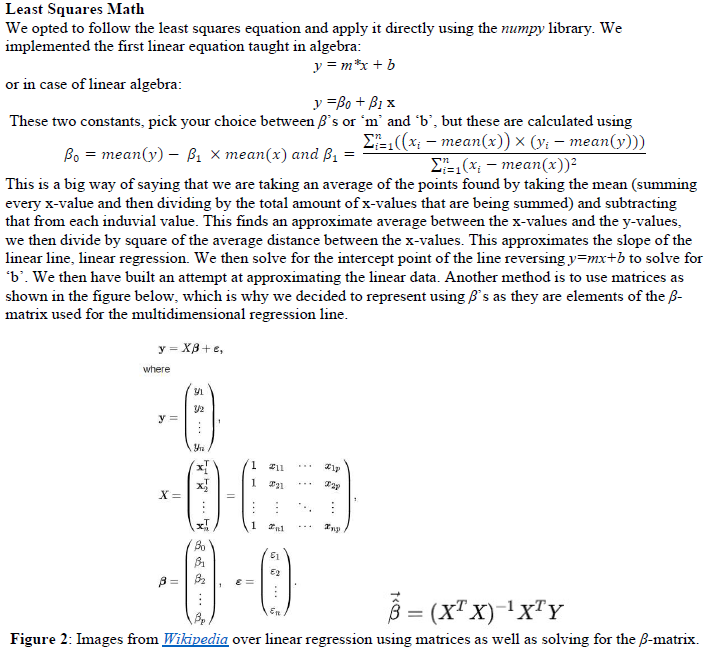

### Linear Regression 

## Introduction
First, we would like to start off by saying that either the multidimensional linear regression or the polynomial regression can be used in place of the simple one-dimensional linear regression algorithm that we used. We understand that the constants can be found even quicker using the numpy library, but we wanted to explore some other functionality found within the library. We opted to do the standard equation that takes more time to calculate.  Speaking of the equation, we will explain how linear regression works first. 

## Theory

## Class Outline 
The class has the following functions: 
 - i.   __init__()
 - ii.  approximate_y()
 - iii. rmse()
 - iv.  graph()

# __init__()
The __init__() function simply initializes the class and assigns it to an object of the user’s choice. This function only has two variables used for the class. The variable weight is a one-dimensional array that contains two elements. The first value is the intercept variable, and the second variable holds the slope of the line. It is sort of like someone started writing this class to be implemented into a multidimensional linear regression class ;)

# predict(x=[n, 1]ndarray, y=[n, 1]ndarray)
The predict() function is where almost all of the math equations happen with the exception of a helper function that we will cover next. This function needs to be feed two 1-d numpy_array’s for the x-values and the y-values, we believe that a standard list will be converted over to this array type. The fucntion calculates the mean of x and y and stores those values to speed operations up, by using the numpy library mean() function, which gets the mean of the x-array and the y-array. We then calculate the slope value by using the numpy library functions sum() and then apply the slope function. Once we have found the slope value, we then calculate the intercept value by using the mean variables we calculated earlier in the form of the previously mentioned slope equation. We decided to store the predicted y-values of our newly found equation by using the helper function approximate_y(), which runs through the x-value array and creates a predicted y-array. Lastly, we use the rsme() function which applies the RMSE equation and gives the correlation value between the predicted line and actual value points.

# approximate_y(x=[n, 1]ndarray)
The approximate_y() function takes in a 1-d numpy_array holding the x-values that will then used to create the approximate line using the slope coefficient value and the intercept value from the predict() function. This returns a 1-d numpy_array of the predicted y-values. 

# rmse(y=[n, 1]ndarray)
The rmse() function takes in a 1-d numpy_array holding the y-values the user wants to see the correlation between the predicted y-values. 
Note: The user must make sure that the data sets have the same amount of values. This function then preforms the RMSE equation by using the numpy library sum() function and then dividing by the length of y-array. Lastly, it returns the square root of this value, we are considering making this into a mean-square-error function in the future. 

# graph(x=[n, 1]ndarray, y=[n, 1]ndarray) 
The graph() function takes in two 1-d numpy_array’s for the x-values and the y-values, recalculates the RSME and then uses the matplot library to create a scatter plot of the given arrays. We decided to add in the equation of the predicted line as well as the RSME value. Lastly, we decided to plot the y-predicted values along with the user inputted y-array.

## Usage
Use the inluced test file for working examples or use the following steps: 

Use LinearRegression = obj, to create the class. 
obj.predict(x, y) where both x and y are [n by 1] ndarrays
obj.graph(x ,y) where both x and y are [n by 1] ndarrays

Note: both arrays must be the same size each other

## Output 
Here are a few of the outputs from the test file from my previous PDF, hence why the figure numbers are off.

