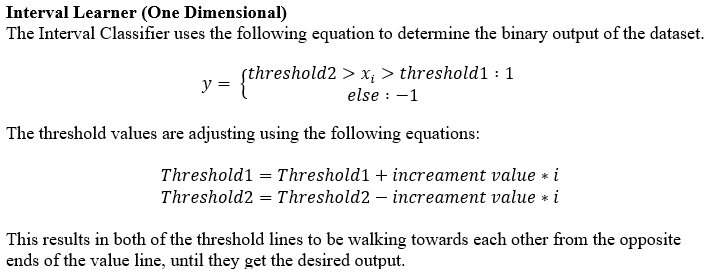

### Interval

## Introduction
The Interval leaner is another 1-d leaner and acts as if there are two threshold learners that are being used. This leaner uses two different thresholds to create a range (interval) that contains only the input values that yield the correct output values. 

## Theory 

## Class Outline
The class has the following functions: 
The class is composed of the following functions:
- i.   __init__()
- ii.  predict() 
- iii. graph()

# __init__(minthreshold=float, maxthreshold=float, iteration=integer, b=integer[must only be 1 or -1])
The __init__() function initializes the class and assigns it to an object. The user must pass in the following values for class variables: 

minthreshold – float variable that holds the minimum threshold value, default is 0.5, but if the user does not know the minimum value in there set then it is recommend that they enter minimum value of their x-array values. 

maxthreshold – float variable that holds the maximum value that the threshold could be, default is 1.0, but if the user does not know the maximum value then it is recommended that they enter the maximum value of their x-array values. 

iteration – integer variable that holds the maximum amount of iterations the threshold learner will take to figure out the data set. Note: Increase this value for a more refined search of the most efficient   
b – integer (should be treated as a Boolean) used by the user to focus on either the desired y-output of 1, or -1, default is 1. Note: User can enter a different value then -1, as the program will still treat that other value as -1. 

Next, we need to talk about the threshold values, which threshold1 is defaulted to the minimum threshold value and threshold2 is defualted to the maxinimum value, once the user uses the class to predict a set of data. 

Lastly, we need to talk about the increment value, which takes the maximum threshold value and subtracts it from the minimum threshold value, this is then divided by the number of iterations that the user inputs. Note: This is why we informed the user to increase the number of iterations if they need a smaller step size between each iteration.   

## predict(x=\[1 by n] ndarray, y\[1 by n] ndarray) 
The predict() function takes in two 1-d numpy_array’s that hold the x-array and the y-array, which the y-array must be integers that are either 1, or -1. We decided to keep track of how many errors occur while trying to figure out the correct threshold value. We then determine if the user put in 1 or not 1 into the b-value, by checking to see if it is equal to 1. If it is equal to 1, the not_b is set to -1, otherwise not_b is set to 1. 

The function then loops from zero until the maximum value of iterations and preforms the following actions. We will compare the current x value to see if it less than the threshold value 1, if it is then we will do one last compare against the threshold value 2. If the value lies within this then it have a result of y\[i] = b. If it fails either of these, then the value must lie outside the range. 

We will use numpy to collect and compare the output values to the target set to see if you received any errors, if we did then we will adjust the threshold values. If no error is found then we have mastered the data set and can return the model. If the model still needs to be adjusted then we will increament the value of threshold 1 and decrrement the value of threshold 2.

Lastly, if the data is not mastered before we run out of iterations, we will have to return the value of the best predicted model. This is done the same way as the threshold learner. 

## graph(x=[1 by n] ndarray, y[1 by n] ndarray) 
This fucntion is used to graph the best fitted interval of the data set. Both x and y need to be 1 by n ndarrays. 

## Usage
Use the included test file or the following:
obj = IntervalLearner(float, float, integer, integer)
obj.fit(x, y)
obj.plot(x, y)
